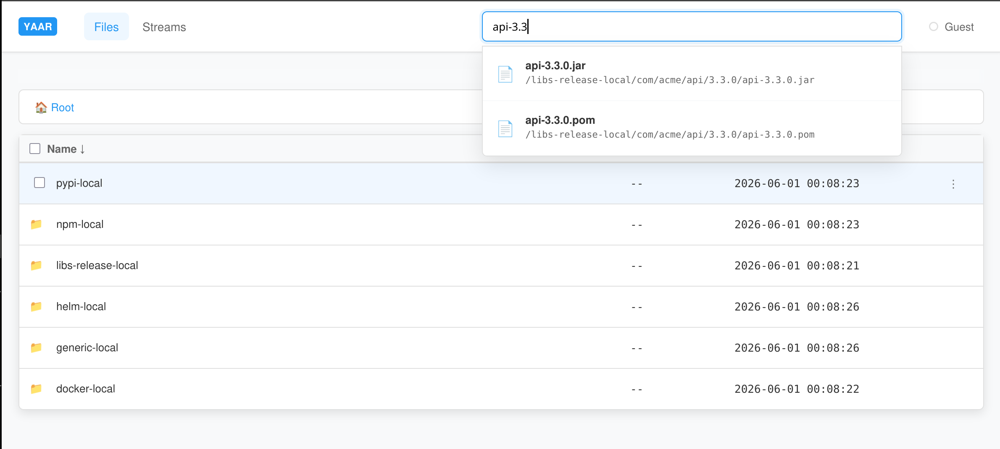
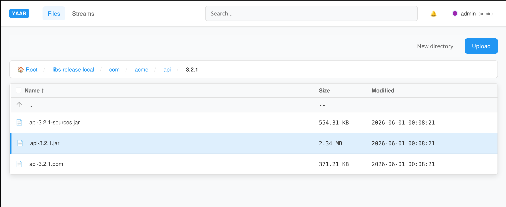
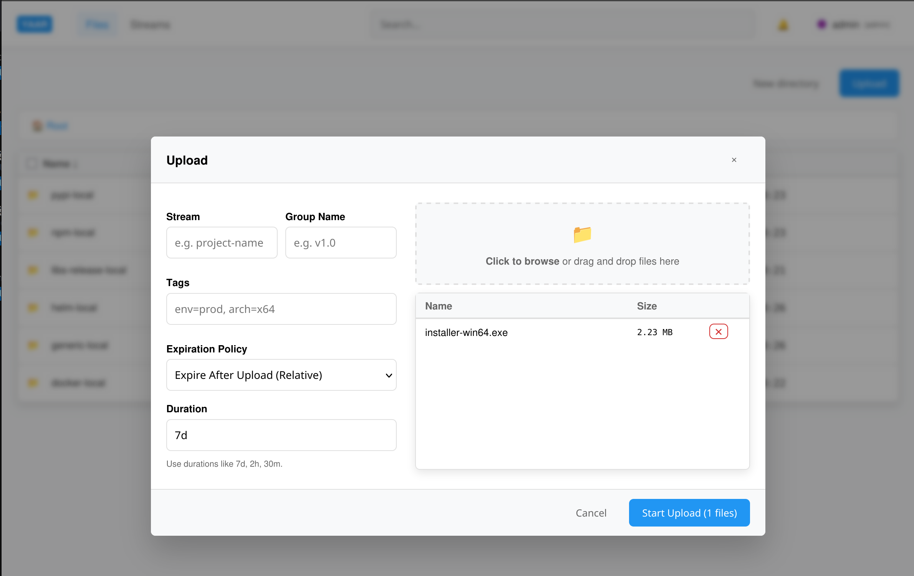
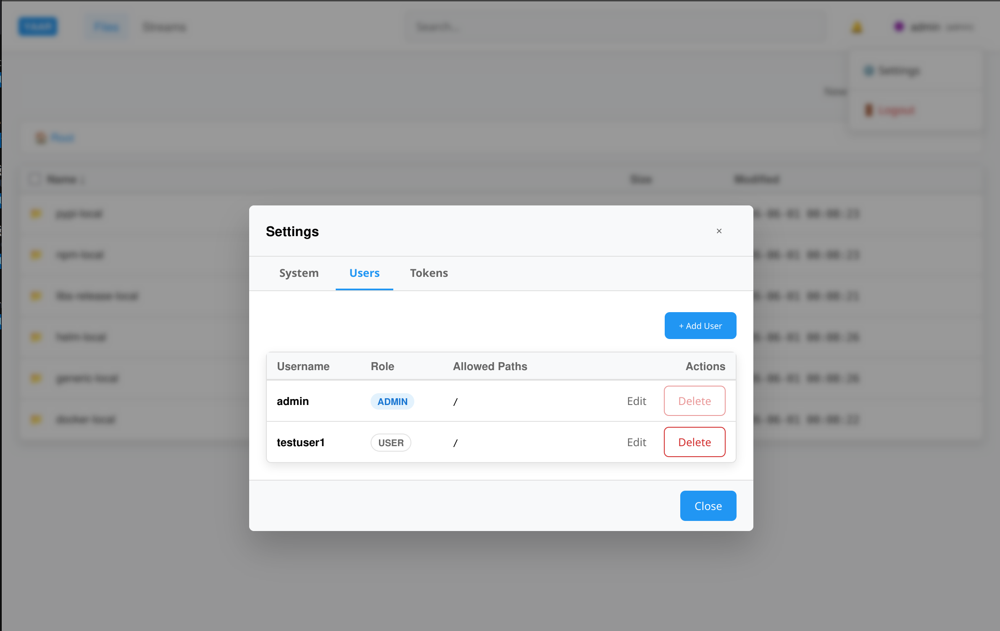

# Yaar (Yet Another Artifact Repository)

Yaar is a lightweight, Go-based artifact server that stores and manages files on your local filesystem. Built with a Gin/GORM/SQLite backend and a Vanilla JS single-page application frontend, it offers a robust alternative to complex artifact managers.



## Security Model — read this first

**Reads are public. Writes require credentials.**

Yaar is an HTTP interface over a shared directory — the role a read-only SMB/CIFS share used to
play. It deliberately reproduces that model:

- **Anyone can download.** `GET`/`HEAD` on any path, directory listings, search, and batch ZIP
  download are all anonymous. No token is required and none is checked.
- **Only authenticated users can change anything.** Upload, delete, rename/move, and metadata
  changes require a JWT or an API token.
- **Every change is audited.** Writes are recorded in the audit log with the acting user, so an
  unexpected modification can always be traced back.

This is a deliberate design decision, not an oversight. It follows directly from the goal: make an
existing shared directory reachable over HTTP, so `curl`/`wget`/a browser work with no credential
setup, while the write path gains the authentication and audit trail a plain file share never had.

**What this means in practice:**

- `allowed_paths` on a user or token **scopes writes only**. A token limited to `/builds/ci` cannot
  upload elsewhere, but it — and every anonymous client — can read the entire tree. `allowed_paths`
  is not a read ACL and does not create tenant isolation.
- **Do not store secrets in Yaar.** Anything placed in the storage directory is readable by anyone
  who can reach the port. Treat the whole tree as world-readable.
- **Restrict exposure at the network layer.** Yaar has no TLS of its own (see
  [Deployment](#deployment)); run it on a trusted network or behind a reverse proxy, exactly as you
  would have scoped access to the file share it replaces.

If you need per-user read restrictions, Yaar is not currently the right tool — read ACLs are not
implemented.

## Key Features

- **Public reads, authenticated writes:** Downloads need no credentials; every modification requires a JWT or API token and is audited.
- **Dual Authentication:** Login with standard JWT or use API Tokens restricted to specific directory prefixes (e.g., `/builds/ci/*`). Both are sent via `Authorization: Bearer`. These prefixes restrict **writes**; reads are public.
- **Lifecycle & Retention:** Automatically expire files based on upload time, last download activity, or absolute deadlines.
- **Streams & Groups:** Organize files into versioned streams. You can enforce policies like keeping only the latest version or auto-pruning previous groups.
- **Data Integrity:** Automatically calculates and verifies SHA256, SHA1, and MD5 checksums.
- **Directory Pruning:** Automatically clean up empty parent directories when files expire or are deleted.
- **Global Search:** Quickly find artifacts by filename, path, tags, or stream.
- **Audit Logging:** Keep track of all system actions through a dedicated JSON audit trail.



## Core Usage

### File Access
Yaar works like a standard web server. You can use standard tools like `curl`, `wget`, or your browser to fetch files. Downloads need no credentials; uploads and deletes do.

- `GET /*path` - Download a file. *(anonymous)*
- `HEAD /*path` - Get file metadata (size, checksums, type). *(anonymous)*
- `PUT /*path` - Upload a file via raw binary stream. *(auth required)*
- `DELETE /*path` - Delete a file. *(auth required)*

`GET` supports HTTP range requests (`Range: bytes=...`), so large artifacts can be resumed or fetched in parts.

### Metadata & System APIs
All file metadata operations live under the `/_/api/v1/fs` path.

- `GET /_/api/v1/fs/*path` - List directory contents or view file metadata. *(anonymous)*
- `PATCH /_/api/v1/fs/*path` - Update file metadata (tags, expiry). *(auth required)*
- `POST /_/api/v1/fs/*path` - Perform system actions (e.g. create directory, rename). *(auth required)*
- `GET /_/api/v1/search?q=...` - Search for artifacts globally. *(anonymous)*
- `GET /_/api/v1/batch?p=/a&p=/b` - Batch download multiple files as a ZIP. *(anonymous)* Repeat `p` for each path. Optional params: `mode=literal` (default, preserves folder names) or `mode=merge` (flattens into a single root); `name=custom` overrides the ZIP filename. The default filename is the entry name for a single selection, or the nearest common parent directory for multiple.
- `DELETE /_/api/v1/batch` - Delete multiple paths in one request. *(auth required)*
- `GET /_/api/v1/settings` - View system status. *(auth required)* Any logged-in user sees version and resource usage; the full configuration, commit and dependency list are admin-only.

Directory listings are paginated: `limit` (default and maximum 1000) and `offset`, with the total
entry count returned in the `X-Total-Count` header.

- `GET /_/hp` - Health check. *(anonymous)* Returns `200` with
  `{"status":"ok","checks":{"database":"ok","storage":"ok"}}` when the database is reachable and
  the storage directory is writable, or `503` with the failing check marked `"fail"`. `HEAD` is
  supported for uptime monitors. The body names which check failed but never paths or driver
  errors — details go to the log. Intended for load balancers and monitoring, so it needs no
  credentials.

Admin-only system endpoints:
- `POST /_/api/system/vacuum` - Manually trigger database vacuuming. VACUUM also runs
  automatically every `AF_VACUUM_INTERVAL` (default weekly); this endpoint is for reclaiming
  space immediately after a large cleanup rather than waiting for the next run.
- `GET /_/api/system/janitor/errors` - View background cleanup errors.
- `DELETE /_/api/system/janitor/errors/:key` - Clear a specific cleanup error.

### Retention Policies
Set retention policies at upload time via HTTP headers or later via PATCH request.

Example upload headers:
- `Yaar-Retention-Expire-After-Upload: 30d` (Expires 30 days after upload)
- `Yaar-Retention-Expire-After-Download: 7d` (Keeps the file alive as long as it's downloaded at least once a week)
- `Yaar-Retention-Expire-At: 2026-12-31T00:00:00Z` (Expires at an absolute timestamp)
- `Yaar-Retention-Immutable: true` (Prevents deletion or modification)
- `Yaar-Retention-Auto-Prune: true` (Directory: auto-delete when it becomes empty)
- `Yaar-Retention-Prune-Children: true` (Directory: delete child directories when they become empty)



### Streams
Streams group related files together so they expire as a single unit. For example, a `releases` stream can hold different versions (`v1.0`, `v2.0`).

- `GET /_/api/v1/streams` - List all streams.
- `GET /_/api/v1/streams/:name` - View details and groups of a stream.
- `PUT /_/api/v1/streams/:name` - Configure stream policies (e.g., retain the latest group, auto-expire previous).
- `PATCH /_/api/v1/streams/:name` - Partially update stream policies.

To upload a file to a stream, add these headers:
`Yaar-Stream: releases`
`Yaar-Group: v1.0`

## Authentication

Credentials are needed only to **change** things. Downloads are anonymous — see
[Security Model](#security-model--read-this-first).

Both credential types are sent in the standard `Authorization: Bearer` header, so any HTTP client works without custom header support. Requests without the header are treated as anonymous, which is sufficient for any read.

- **JWT** - obtained from `POST /_/api/login`, short-lived, its `allowed_paths` scoping the user's writes. Used by the web UI.
- **API Token** - created via `POST /_/api/tokens`, long-lived and revocable, its own `allowed_paths` scoping that token's writes. Used by CI jobs and scripts. API tokens are prefixed with `af_`, which is how the server tells them apart from JWTs.

In both cases `allowed_paths` is a **write** scope. It restricts where the credential may upload, delete or rename; it never restricts what can be read.

```sh
# Upload with an API token
curl -H "Authorization: Bearer af_1a2b3c..." --upload-file build.zip \
  http://localhost:8080/builds/ci/build.zip

# Upload with a JWT
curl -H "Authorization: Bearer eyJhbGciOi..." --upload-file build.zip \
  http://localhost:8080/builds/ci/build.zip
```

The plain-text API token is returned **only once**, in the response to `POST /_/api/tokens`. Store it at that point; only its hash is kept server-side. Tokens may also carry an expiry, after which requests are rejected with `401`.

## Administration

### First start

On a brand-new instance (empty user table) Yaar creates an `admin` account with a **randomly
generated password**, printed once to stdout at startup:

```
========================================================================
  Created initial admin user.

      username: admin
      password: k3Jq8vN2xPbR7mZtLdW4yF1s

  This password is shown ONCE and cannot be recovered.
  Store it now, then change it from the UI or via
  PATCH /_/api/admin/users/:id.
========================================================================
```

Capture it from the startup output — only the bcrypt hash is stored, so it cannot be recovered
later. If you lose it, delete the admin row from the database and restart to bootstrap a new one.

This runs **only when no users exist**. Upgrading an existing installation never changes any
password; accounts keep the credentials they already have.

Failed logins are rate limited per username and client IP: 5 failures trigger a lockout that grows
from 1 minute up to 1 hour, and the response carries `Retry-After`. Both successful and failed
logins are recorded in the audit log as `USER_LOGIN`.

### APIs

- `POST /_/api/login` - Login to get a JWT.
- `GET /_/api/auth/me` - Get current user info.

User Management (Admin only):
- `GET /_/api/admin/users` - List all users.
- `POST /_/api/admin/users` - Create a new user.
- `PATCH /_/api/admin/users/:id` - Update user details or reset password.
- `DELETE /_/api/admin/users/:id` - Delete a user.

Token Management:
- `GET /_/api/tokens` - List all API tokens.
- `POST /_/api/tokens` - Generate a new scoped API token.
- `DELETE /_/api/tokens/:id` - Revoke an API token.



## Configuration

Configure Yaar via `config.yml`, environment variables, or CLI flags.

`config.yml` is **not** committed — it holds the JWT secret, and a shared secret
lets anyone forge admin tokens. Copy the template and set your own secret before
first run:

```sh
cp config.example.yml config.yml
# then set jwt_secret to 32+ random characters, e.g. `openssl rand -base64 48`
```

The server refuses to start while the secret is still the example placeholder,
so an unconfigured instance fails fast rather than booting with a public key.

| Option | Env Var | CLI Flag | Default |
| --- | --- | --- | --- |
| Config File | — | `--config` | `config.yml` |
| Server Port | `AF_PORT` | `--port` | `8080` |
| Database File | `AF_DB_FILE` | `--db` | `artifactory.db` |
| Base Storage Dir | `AF_BASE_DIR` | `--data-dir` | `storage` |
| Web Assets Dir | `AF_WEB_DIR` | `--web-dir` | `web` |
| Max Upload Size | `AF_MAX_SIZE` | `--max-upload-size` | `100MB` |
| Audit Log File | `AF_AUDIT_LOG` | `--audit-log` | `audit.log` |
| Audit Rotation Size | `AF_AUDIT_MAX_SIZE` | — | `100MB` |
| Audit Backups Kept | `AF_AUDIT_MAX_BACKUPS` | — | `5` |
| Audit Stdout Mirror | `AF_AUDIT_MIRROR_STDOUT` | — | `false` |
| Vacuum Interval | `AF_VACUUM_INTERVAL` | — | `168h` |
| Log Level | `AF_LOG_LEVEL` | `--log-level` | `info` |
| Protected Paths | `AF_PROTECTED_PATHS` | — | (None) |

*The scheduled VACUUM holds the single SQLite connection while it runs, so requests block for its
duration — hence the weekly default. Set `AF_VACUUM_INTERVAL=0` to disable it and rely on the admin
endpoint alone.*

*Log level accepts any logrus level: `panic`, `fatal`, `error`, `warn`, `info`, `debug`, `trace`.
An invalid value fails at startup rather than being silently ignored.*

*Audit entries are written to the audit log file only. Enable `AF_AUDIT_MIRROR_STDOUT` to also
emit them on stdout, for deployments that ship container logs to a collector — note the mirrored
copy is subject to no rotation.*

### Audit log rotation

The audit log rotates once it reaches `AF_AUDIT_MAX_SIZE`: the live file is renamed to
`audit.log.1`, existing backups shift down (`.1` → `.2`, and so on), and the oldest beyond
`AF_AUDIT_MAX_BACKUPS` is deleted. Worst-case disk use is roughly
`max_size × (max_backups + 1)` — about 600MB at the defaults. Setting `max_backups` to `0`
rotates without keeping any history.

Rotation never splits an entry: the file is rolled *before* a write that would exceed the cap,
so every line in every generation is complete JSON.

The admin audit-log API pages across generations transparently. Because a rotation invalidates
raw byte offsets, `GET /_/api/v1/admin/audit-log` returns `next_generation` alongside
`next_before_offset`, plus a `has_more` flag — after a rotation a continuation legitimately
starts at offset `-1` (the end of the next older file), so `has_more` rather than the offset is
what tells a client whether another page exists. Clients should echo both cursors back.

*Note: The JWT secret must be defined in `config.yml` or via `JWT_SECRET` and be at least 32 characters long.*

## Testing

Run everything with the top-level script:

```sh
./test.sh              # lint + all suites
./test.sh unit         # Go unit + wiring tests (fast)
./test.sh integration  # Go integration suite
./test.sh e2e          # browser suite (needs Playwright; bootstraps itself)
./test.sh lint         # gofmt, go vet, Biome
```

There are three layers:

| Suite | Location | What it covers |
| --- | --- | --- |
| Unit + wiring | package roots, `app_test.go` | Individual packages, plus `BuildApp`/`Serve` — route/auth wiring, config precedence, graceful shutdown |
| Integration | `integration/` | The HTTP API against a real DB and filesystem, driven in-process |
| End-to-end | `e2e/` | The real compiled binary plus the SPA in a browser (Playwright) |

Settings shared by the suites (JWT secret, protected paths, UI port) live in
`testdata/test-env.sh` so the Go and Python sides cannot drift apart.

The browser suite manages its own virtualenv; `e2e/bootstrap.sh` rebuilds it automatically if it
becomes unusable (a Python upgrade, or the directory being moved).

## Deployment

**Yaar serves plain HTTP and has no TLS support of its own.** Credentials — JWTs and API tokens —
travel in the `Authorization` header in cleartext, so anything that can observe the network can
replay them.

Run it behind a TLS-terminating reverse proxy (nginx, Caddy, Traefik) for any deployment that leaves
a trusted network. The storage tree is world-readable by design (see
[Security Model](#security-model--read-this-first)), so the proxy is also the right place to
restrict *who can reach the service at all* — the same scoping the file share it replaces would have
had.

Yaar shuts down gracefully on `SIGINT`/`SIGTERM`: it stops accepting new connections and lets
in-flight uploads finish (up to 30 seconds) before exiting, so `docker stop` will not truncate an
artifact mid-write.
